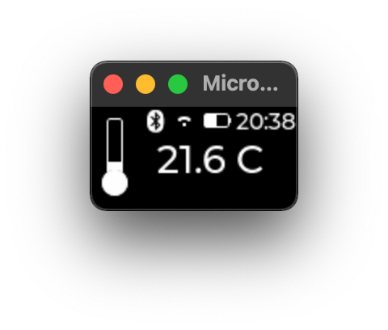

## mmds

Minimal MicroPython Display System : a template SDK for MicroPython - LVGL

Explore GUI development on device with the bare minimum requirements for both software and hardware
i.e. minimal RAM + OLED monochrome display (128x64)

  

- A demo GUI app 

- Simulator

- Tests

- CI/CD workflow

build:

mmds:

docs:

