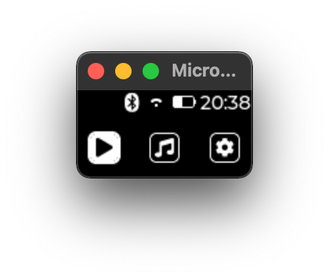

### Simulator

`$ ./install.sh && source build-sim.sh`

Which will do the following:

#### Install requirements

`$ ./install_requirements_macos.sh` or `$ ./install_requirements_linux.sh`

#### Init mmds submodules (micropython, lv_binding_micropython)

`$ git submodule update --init -f --remote`

#### Init lvgl-binding submodules
`$ git submodule update --init --recursive ./build-mplv/user_modules/lv_binding_micropython`

#### Build MicroPython + LVGL
```bash

# working-directory: ./build-mplv/micropython

$ make -C mpy-cross

$ make -C ports/unix submodules

$ make -C ports/unix deplibs

$ make -C ports/unix VARIANT_DIR=../../../ports/unix/variants/UNIX-LVGL

```

#### To Run

Go to `../mmds/sim` directory and run `main.py` i.e.

```sh

$ cd ../mmds/sim

$ $SIM main.py
- mod: aiorepl from aiorepl.py
- mod: asyncio from asyncio/__init__.py
- mod: asyncio.core from asyncio/core.py
- mod: board_config from ./board_config.py
- mod: display_config from ./display/display_config.py
- mod: gui from ./gui/__init__.py
- mod: gui.callbacks from ./gui/callbacks.py
- mod: gui.mgui from ./gui/mgui.py
- mod: gui.testdisplay from ./gui/testdisplay.py
- mod: gui.testrunner from ./gui/testrunner.py
- mod: gui.ui from ./gui/ui/__init__.py
- mod: gui.ui.monoc from ./gui/ui/monoc.py
- mod: gui.ui.style_monoc from ./gui/ui/style_monoc.py
- mod: lv_utils from lv_utils.py
- mod: time from time.py
DISPLAY_MODE: INTERACTIVE
INDEV_MODE: SIM
COLOR_FORMAT: I1
DISPLAY_SIZE: 128 x 64
DISPLAY_DRIVER: DummyDisplay from ./gui/testdisplay.py
OK
Starting asyncio REPL...
-->
```

<div align="center">
  
</div>

### Device

`$ ./install_device_requirements.sh && ./build-device.sh`


Which will do the following:

#### Build MicroPython + LVGL (esp32 port)
      
```sh
# working-directory: ./build-mplv/micropython 

$ source tools/ci.sh && ci_esp32_idf_setup
$ source tools/ci.sh && ci_esp32_build_common

$ make -C ports/esp32 submodules
$ make -C ports/esp32 BOARD_DIR=../../../ports/esp32/boards/ESP32-LVGL
```

#### Flash device see esp32 port [README](https://github.com/micropython/micropython/tree/master/ports/esp32)

Then sync `../mmds/device` to device.
