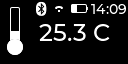

```
mmds/
├── README.md
├── audio
├── device
├── displays
├── fonts
├── gui
├── manifest.py
├── sim
└── tests
```

### Audio

`./audio` libs to control audio devices, e.g. a buzzer 

### Displays 
`./displays` where displays drivers and configs are placed

### Fonts
`./fonts` some test fonts, and a preview tool `show_fonts.py`, i.e. 

from `./sim` run `$ $SIM ../fonts/show_fonts.py hello`

### GUI
`./gui`
```
gui/
├── __init__.py
├── callbacks.py
├── manifest.py
├── mgui.py
├── testdisplay.py
├── testrunner.py
└── ui
    ├── __init__.py
    ├── monoc.py
    └── style_monoc.py

```
Application logic, monochrome UI widgets and styles

### Simulator

`./sim` is the MicroPython-LVGL simulator and it is intended for easy and fast
iteration development, see [sim](./sim/README.md)


### Device

`./device` is intended to match device root filesystem, so sync this directory
to device root filesystem, see [device](./device/README.md)


### Tests

`./tests` Intended for different purposes

```
tests/
├── ci
├── imageconvert.py
├── ivi
└── vi
```
##### CI 

Continous Integration tests, to check the UI elements and generate snapshots
that will be uploaded as artifacts, e.g. 

<div align="center">
  
  
</div>

<div align="center">
  
  
</div>

<div align="center">
  
  
</div>

<div align="center">
  
  
  
  
</div>

##### VI

Visual Integration tests, intended to be run both by the simulator and the device,
check that display driver and UI elements are working as expected

##### IVI

Interactive Visual Integration tests, intended to be run both by the simulator and the device,
check that the indev driver and UI elements are working as expected


To run: 

e.g. in simulator
```
$ MICROPY_MICROPYTHON=$SIM ../build-mplv/micropython/tests/run-tests.py ./tests/vi/*.py -j1
platform=darwin arch=x64
pass  ./tests/vi/test_marc.py
pass  ./tests/vi/test_mbar.py
pass  ./tests/vi/test_mbtn.py
pass  ./tests/vi/test_mgui.py
pass  ./tests/vi/test_mlabel.py
pass  ./tests/vi/test_qr.py
pass  ./tests/vi/test_statusb.py
7 tests performed (364 individual testcases)
7 tests passed
```

or device

```
$ MICROPY_MICROPYTHON=$SIM ../build-mplv/micropython/tests/run-tests.py ./tests/vi/*.py -t /dev/tty.usbmodem3370377430371
platform=pyboard arch=armv7emsp inlineasm=thumb
pass  ./tests/vi/test_marc.py
pass  ./tests/vi/test_mbar.py
pass  ./tests/vi/test_mbtn.py
pass  ./tests/vi/test_mgui.py
pass  ./tests/vi/test_mlabel.py
pass  ./tests/vi/test_qr.py
pass  ./tests/vi/test_statusb.py
7 tests performed (364 individual testcases)
7 tests passed

```
