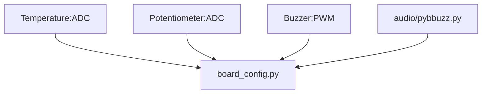
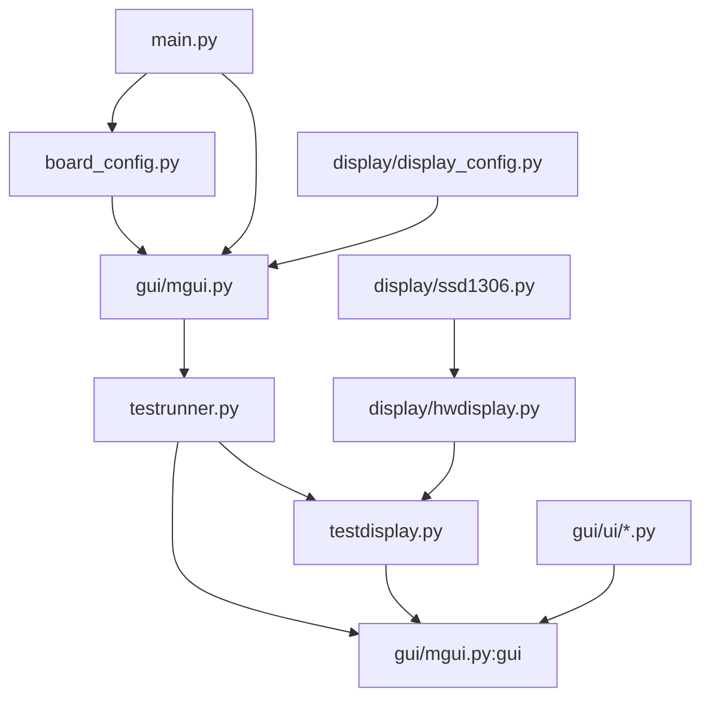

```
./device
├── README.md
├── audio -> ../audio/buzzer/pyboard
│   └── pybbuzz.py
├── board_config.py
├── boot.py
├── display -> ../displays/ssd1306
│   ├── display_config.py
│   ├── hwdisplay.py
│   └── ssd1306.py
├── gui -> ../gui
│   ├── __init__.py
│   ├── callbacks.py
│   ├── manifest.py
│   ├── mgui.py
│   ├── testdisplay.py
│   ├── testrunner.py
│   └── ui
│       ├── __init__.py
│       ├── monoc.py
│       └── style_monoc.py
├── main.py
└── testrunner.py
```

> [!TIP]
> Use `mpy-cross` to freeze `.py` to `.mpy` so the application can save RAM.
> Also change `sys.path` order to use frozen `gui`, check `main.py` and
> `board_config.py` to enable
> this.

#### Hardware Requirements:
- Monochrome OLED display (128x64) [^1]
- Potentiometer [^2]
- Button [^3] (optional)
- Buzzer [^4] (optional)
- Temperature sensor [^5] (optional)


#### Application logic:

Configuration is controlled by `board_config.py` and `display/display_config.py`
and the execution flow is the same as the `./sim` but with `board_config.py`
doing part of hardware setup, and the display/indev drivers from
`display/hwdisplay.py`,`display/ssd1306.py` :





```
MicroPython v1.26.0-preview.307.g2d463fabe2 on 2025-07-05; PYBv1.1 with STM32F405RG
Type "help()" for more information.
>>>
MPY: sync filesystems
MPY: soft reboot
- mod: aiorepl from aiorepl.py
- mod: asyncio from asyncio/__init__.py
- mod: asyncio.core from asyncio/core.py
- mod: board_config from board_config.py
- mod: display_config from /flash/display/display_config.mpy
- mod: gui from gui/__init__.py
- mod: gui.callbacks from gui/callbacks.py
- mod: gui.mgui from gui/mgui.py
- mod: gui.testdisplay from gui/testdisplay.py
- mod: gui.testrunner from gui/testrunner.py
- mod: gui.ui from gui/ui/__init__.py
- mod: gui.ui.monoc from gui/ui/monoc.py
- mod: gui.ui.style_monoc from gui/ui/style_monoc.py
- mod: lv_utils from lv_utils.py
- mod: pybbuzz from /flash/audio/pybbuzz.mpy
- mod: time from time.py
DISPLAY_MODE: INTERACTIVE
INDEV_MODE: ENCODER
COLOR_FORMAT: I1
DISPLAY_SIZE: 128 x 64
DISPLAY_DRIVER: HwDisplayDriver from ./display/hwdisplay.mpy
OK
Starting asyncio REPL...
-->
```


#### UI navigation    

Rotate potentiometer to select and click Button to enter an app, click again to return to menu.

> [!Note]
> Hardware parts


[^1]: https://octopart.com/en/search?q=ssd1306&currency=USD&specs=0 
[^2]: https://octopart.com/en/search?q=potentiometer+rotary&currency=USD&specs=0
[^3]: https://octopart.com/en/search?q=TS02-66-70-BK-100-LCR-D&currency=USD&specs=0
[^4]: https://octopart.com/en/search?q=buzzer+piezo&currency=USD&specs=0
[^5]: https://octopart.com/en/search?q=tmp36&currency=USD&specs=0
