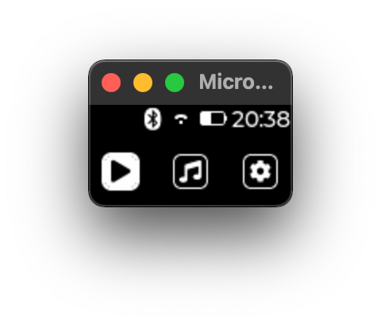

The directory structure matchs the expected directory structure of a device:

```
./sim
├── README.md
├── board_config.py
├── display -> ../displays/sim
│   └── display_config.py
├── gui -> ../gui
│   ├── __init__.py
│   ├── callbacks.py
│   ├── manifest.py
│   ├── mgui.py
│   ├── testdisplay.py
│   ├── testrunner.py
│   └── ui
│       ├── __init__.py
│       ├── monoc.py
│       └── style_monoc.py
└── main.py
```

#### Application logic:

Configuration is controlled by `board_config.py` and `display/display_config.py`

and the execution flow is the following:


`main.py` loads configuration from `board_config.py` which is passed to the gui
application `mgui.py`. This gui application setups the display using the
configuration from `display_config.py`, setups the UI from `gui/ui` and runs the
asyncio event loop with aiorepl included.


#### Run

```
$ cd ./sim && $SIM main.py
- mod: aiorepl from aiorepl.py
- mod: asyncio from asyncio/__init__.py
- mod: asyncio.core from asyncio/core.py
- mod: board_config from ./board_config.py
- mod: display_config from ./display/display_config.py
- mod: gui from ./gui/__init__.py
- mod: gui.callbacks from ./gui/callbacks.py
- mod: gui.mgui from ./gui/mgui.py
- mod: gui.testdisplay from ./gui/testdisplay.py
- mod: gui.testrunner from ./gui/testrunner.py
- mod: gui.ui from ./gui/ui/__init__.py
- mod: gui.ui.monoc from ./gui/ui/monoc.py
- mod: gui.ui.style_monoc from ./gui/ui/style_monoc.py
- mod: lv_utils from lv_utils.py
- mod: time from time.py
DISPLAY_MODE: INTERACTIVE
INDEV_MODE: SIM
COLOR_FORMAT: I1
DISPLAY_SIZE: 128 x 64
DISPLAY_DRIVER: DummyDisplay from ./gui/testdisplay.py
OK
Starting asyncio REPL...
-->
```

<center>



</center>

UI diagram:


##### Thermometer
<center>


</center>

##### Plot
<center>


</center>

##### Settings
<center>


</center>

>[!NOTE] 
> Navigate the UI pressing the "app" buttons and click below Statusbar to go
> back to menu


>[!TIP]
> Use [watchfiles](https://github.com/samuelcolvin/watchfiles#cli) to
> automatically
> reload the sim on changes e.g. `$  watchfiles --filter python "micropython main.py" . *.py **/*.py **/*/*.py`

